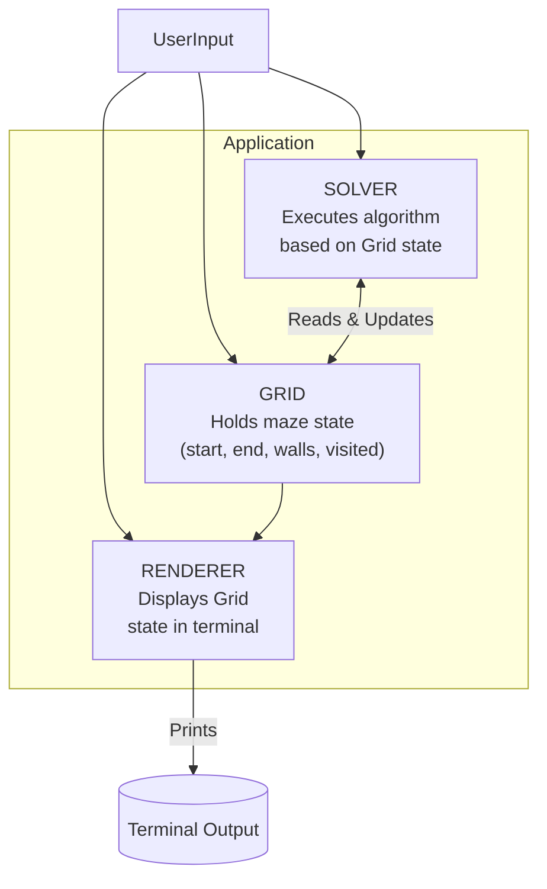

# Pathfinders
A CLI based interactive demo of various pathfinding algorithms such as BFS, DFS, Djikstra's algorithm, and A*.  

## Implementation
### How to Run
If the executable (`.exe`) does not exist, navigate to the root folder and execute:
```shell
g++ -std=c++17 -Iinclude src/*.cpp -o game
```
Then run the program from the terminal by running `./game.exe`. Alternatively, execute the program via your GUI file explorer.

> [!TIP]
> It is recommended to run this program via a dedicated CLI and not an integrated interface, such as that within VS Code or in the browser. 

### In Program Commands
The program consists of two modes, 
(1) SETUP Mode - configure the grid
(2) SOLVER Mode - visualise the selected pathfinding algorithm.

During **SETUP**, you initialise the program. You can place starting and ending points, as well as place walls and obstructions for the SOLVER to navigate a path around. During setup, you have the following commands:
- `PSA [x] [y]`, place starting point at coordinate x, y.
- `PEA [x] [y]`, place ending point at coordinate x, y.
- `PWA [x] [y]`, place wall at coordinate x, y.
- `PHL [x] [y] [l]`, place a horizontal wall starting at x, y, of length l.
- `PVL [x] [y] [l]`, place a vertical wall starting at x, y, of length l.
- `ALGO [algo]`, select algo for solver
- `RUN`, start solving
- `END`, exit the program
The program will check to confirm whether the starting state is valid, and if so, will enter the SOLVER mode. There are four currently supported algorithms, `BFS`, `DFS`, `DJIKTSRA`, and `AStar`. During the **SOLVER** phase the program will use the chosen algorithm to find a path between the starting and end points. Once found you may return to SETUP or End the program.

### Project Structure
```
/ [root]
├── include/         # Header files
├── src/             # Source files
├── game.exe         # Compiled executable (after build)
└── README.md        # This file
```

The program consists of two main handlers. A `Solver`, and a `Renderer`, are implemented to maintain a seperation of concerns between the core logic of the program and the visualisation of the program. Both act upon or read from a `Grid` which manages the storage of information related to the game state.

